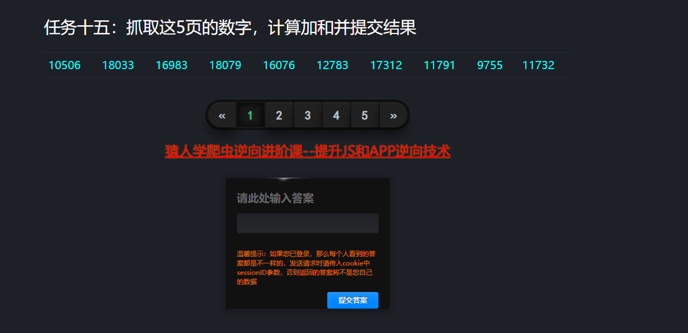
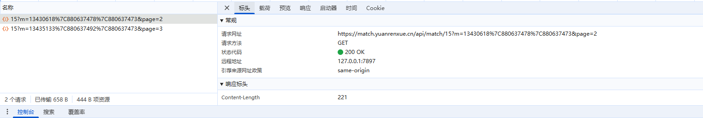
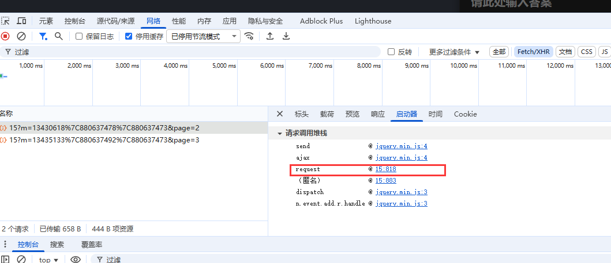
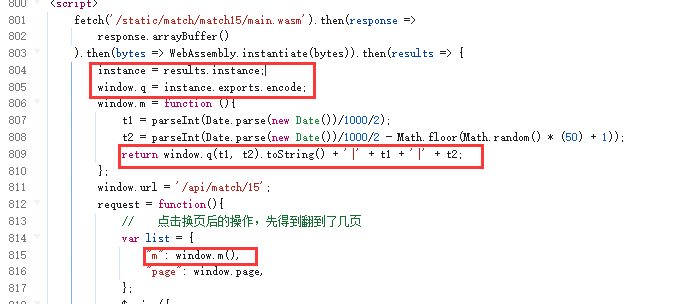
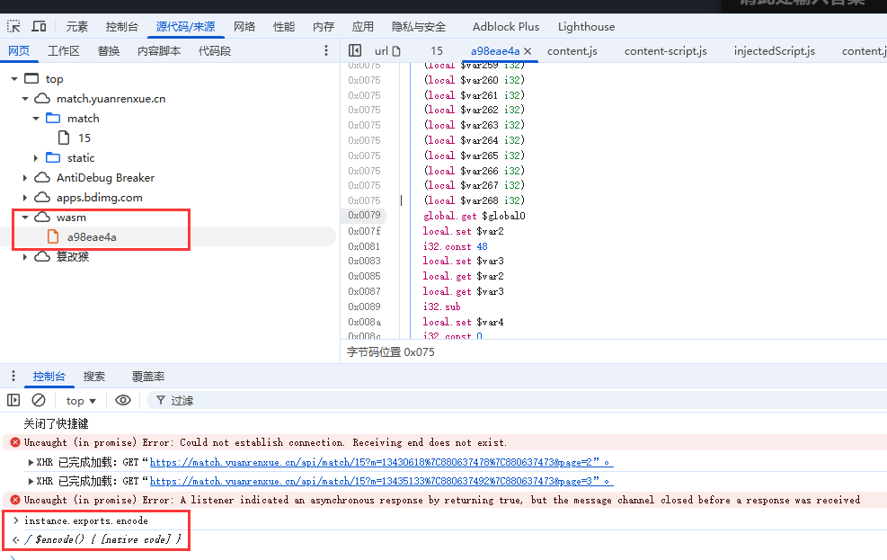
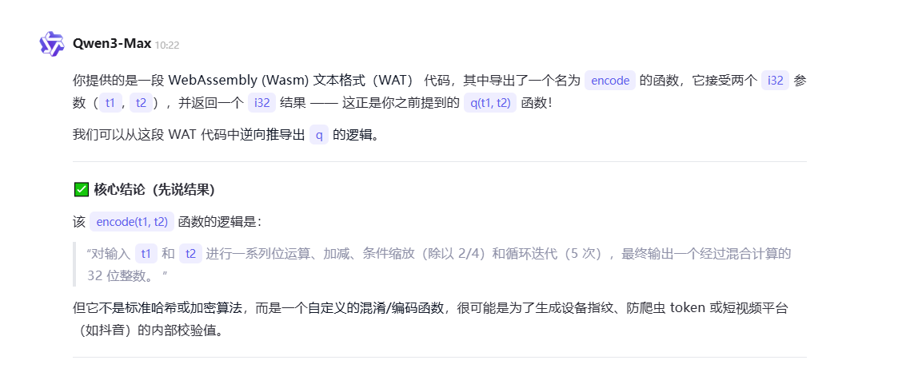

# 题目：抓取这5页的数字，计算加和并提交结果

## 地址:https://match.yuanrenxue.cn/match/15



#### 观察请求头,发现m值是变动的，找出m值的生成方式



#### 启动器找到request，准备打断点



#### 也没有什么混淆，断点也不用打，进来就看到m了。看一下内部逻辑，m的后两个值t1，t2一目了然，主要找到q(t1,t2)的生成方式



#### 打印instance.exports.encode跳转到wasm文件中，看不懂，问一下ai



#### 很明显，整个文件就是一个encode函数，接收两个参数，进行加密后返回加密值。可以让ai分析内部逻辑给出python版相同功能的代码，也可以直接执行这个加密函数文件



#### 我这里直接执行源文件了，先请求这个文件，然后使用pywasm库执行, 固定t1，t2打印结果，结果和浏览器一致
pip install pywasm==1.0.8

一开始安装pywasm库的时候没有指定版本，导致我的程序一直报错，后来指定版本为1.0.8后报错消失。

```
import pywasm
wasm_url = "https://match.yuanrenxue.cn/static/match/match15/main.wasm"
resp1 = requests.get(wasm_url)
with open("main.wasm", mode="wb") as file:
	file.write(resp1.content)

module = pywasm.load('./main.wasm')
result = module.exec('encode', [t1, t2])
```

#### 将m和t1，t2拼接起来，尝试请求一下，请求成功。下面循环请求所有页数并将返回值相加即可

